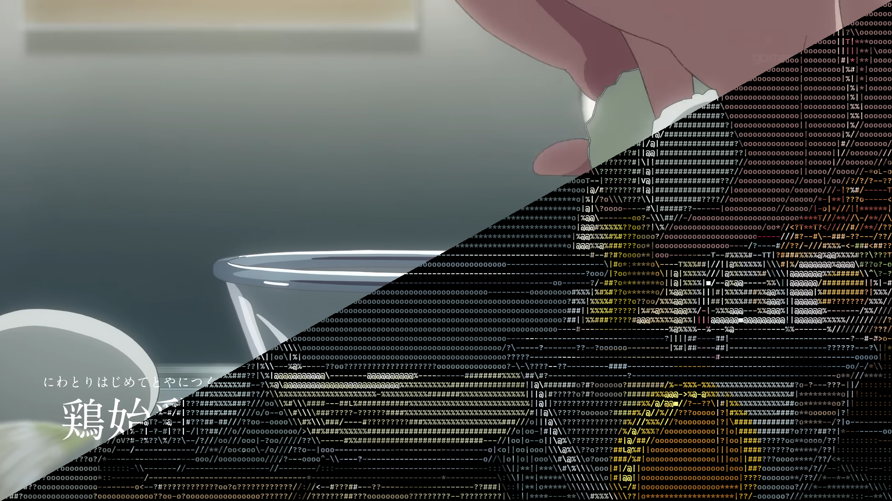
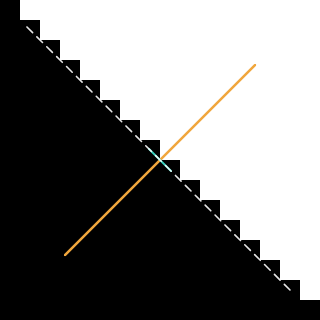
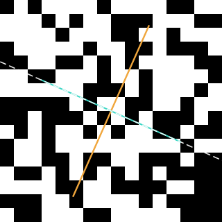
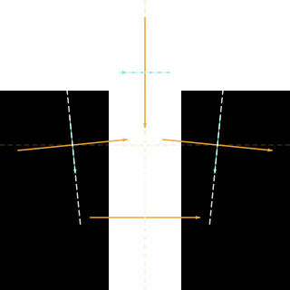
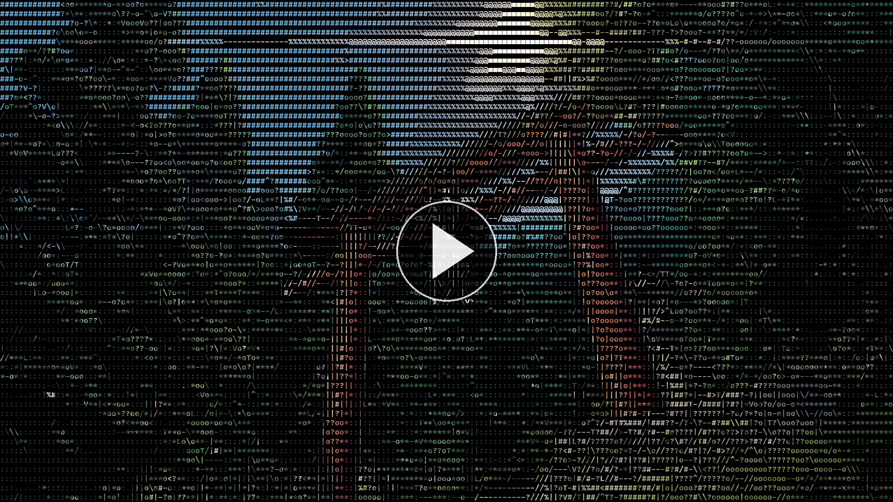

<h1 align="center">
    edgecii-art
    <br />
    <br />
    
    <br />
</h1>

<h4 align="center">
    Fast Image/Video to ASCII Art with Coherent Contours
</h4>

<div align="center">


</div>

<p align="center">
  <a href="#how-it-works">How it Works</a> •
  <a href="#why-not-x">Why not X?</a> •
  <a href="#video-demo">Video Demo</a> •
  <a href="#running">Running</a> •
  <a href="#development">Development</a> •
  <a href="#license">License</a>
</p>

## How it Works

The traditional approach to ASCII is to take an image and map each cell's brightness to a character. This works and is fast, but doesn't look too great as it discards a lot of information.

An obvious improvement is to include some "edge characters" along with "luma characters". This can be done in several ways but a first common step for most approaches (including this one) is a [sobel filter](https://en.wikipedia.org/wiki/Sobel_operator), which involves convolving the image with two 3x3 kernels to generate horizontal and vertical gradients.

The next step is to iterate over all cells of the image, and generate [structure tensors](https://en.wikipedia.org/wiki/Structure_tensor) for each quadrant of the cell like so:

$$
S =
\begin{bmatrix}
\sum g_x^2 & \sum g_xg_y \\
\sum g_xg_y & \sum g_y^2
\end{bmatrix}
$$

where $g_x$ and $g_y$ are sobel gradients.

We also sum the brightness of the cell's pixels in case it does not contain an edge.

Next, we compute the coherence, $c$ of the quadrants using the eigenvalues:

$$
c = \frac{\lambda_1 - \lambda_2}{\lambda_1 + \lambda_2} = \frac{\sqrt{(S_{xx} - S_{yy})^2 + 4S_{xy}^2}}{S_{xx} + S_{yy}}
$$

This tells us how "one-directional" the tensor is. A noisy/flat region will have a low coherence value while a region containing a straight edge will have a high value.

We also compute the perpendicular angle of the edge through eigendecomposition of the tensor:

$$
\theta = \frac{1}{2} \mathrm{atan2}(2S_{xy}, \ S_{xx} - S_{yy})
$$

And the "energy" along an angle of interest $\phi$ using the [Rayleigh quotient](https://en.wikipedia.org/wiki/Rayleigh_quotient):

$$
e = S_{xx} \cos^2{\phi} + 2S_{xy} \sin \phi \cos \phi + S_{yy} \sin^2{\phi}
$$

The perpendicular angle $\theta$ is used to decide the edge characters for cells with a high coherence value, or in other words, cells that contain a single edge only. The Rayleigh quotient is used on cells that have a low coherence value where $\theta$ is meaningless, as it may contain multiple edges, junctions, corners, and so on.

<table align="center">
  <tr>
    <td></td>
    <td></td>
    <td></td>
  </tr>
  <tr>
    <td colspan="3" align="center"><em>Eigenvectors in cells with a clear edge vs noise vs a T-junction</em></td>
  </tr>
</table>

Afterwards, selecting the edge character is a simple decision tree:

| Character | Cell Coherence | Conditions                          |
| --------- | -------------- | ----------------------------------  |
|     \|    |     ≥ 0.6      |   θ ≈ 0°                            |
|      /    |     ≥ 0.6      |   θ ≈ 45°                           |
|      T    |     ≤ 0.6      |   B = '\|', T ≈ 90°                 |
|      X    |     ≤ 0.6      |   TL = '\\', TR = /, BL = /, BR = \ |

If a cell fails all checks, it gets a luma character like in a traditional ASCII art algorithm.

## Why not X?

I've considered using a DoG filter before the sobel pass, but that changes the magnitude of the sobel gradients and requires tuning too many parameters for my liking. Not to mention, noise isn't much of an issue anyway, so it's mostly just wasted compute.

The best-looking solution to this problem is probably comparing each cell to a rendered character atlas, but it's too slow for a real-time renderer and the only advantage it'd give us which structure tensors doesn't already, is the generation of curved glyphs like '(' and ')'.

## Performance

This algorithm is fast enough for real-time rendering of 1080p 60fps videos on a modern 8+ core CPU (such as a Ryzen 5700X or better).

## Video Demo

[](https://youtu.be/Gc6Dx0lRnn8)

## Next steps

In my opinion, this already looks way more pleasant than a traditional naive implementation. Though of course, there are lots of improvements that could be made. Some I can list off the top of my head are:

- An EMA filter for temporally coherent edge character selection across frames
- A bloom filter to brighten the renders which currently look quite dark
- Taking into account regions outside of the current cell, the lack of which is the main reason behind flickering edges between frames

Unfortunately, all of these are too slow to run on a CPU and will require a port to a vulkan compute shader.

## Running

Download the binary for your platform from [releases](https://github.com/incend1um3/edgecii-art/releases), then launch it from a **terminal emulator**:

```bash
# make the binary executable
chmod +x ./edgecii-art-v0.2.0-linux-x86_64-v3

# list the available options
./edgecii-art-v0.2.0-linux-x86_64-v3 --help

# run on an image
./edgecii-art-v0.2.0-linux-x86_64-v3 -i my-image.png --char-height 16
# run on a video
./edgecii-art-v0.2.0-linux-x86_64-v3 -i my-video.mp4 --char-height 16

# renders saved in ./output
ls ./output
```

## Development

Install rust 1.98-nightly or newer (nightly required for `float_algebraic` intrinsics), then run:

```bash
# clone the repo
git clone https://github.com/incend1um3/edgecii-art
cd edgecii-art

# list the available options
cargo run --release -- --help

# run on a test image
cargo run --release -- -i ./test-images/egg.png --char-height 16

# outputs saved in ./output
ls ./output
```

## License

See [LICENSE](LICENSE)

## LLM Usage

[src/ffmpeg_encoder.rs](src/ffmpeg_encoder.rs) and [src/ffmpeg_decoder.rs](src/ffmpeg_decoder.rs) were mostly written by Claude, with manual cleanup and testing done afterwards.
